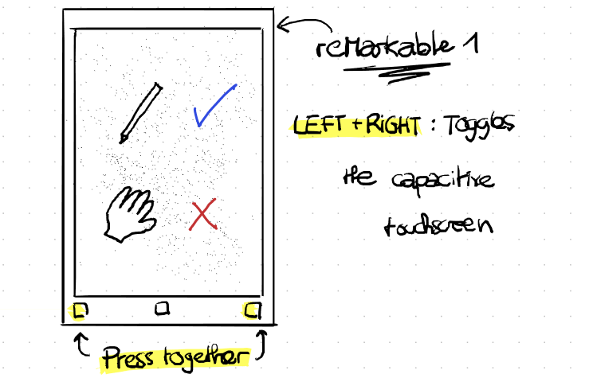

# Toggle Touchscreen for reMarkable 1
_How to associate left+right keys to toggle the capacitive touchscreen of the reMarkable 1 tablet_

The pen (EMR technology) can still be used. As a left-handed person, my left palm always tend to close the current note. Even as a right-handed person, the capacitive display can interact with the palm in a non-desired way while writing/sketching with the pen.



This tutorial is intended for people with beginner-medium knowledge of Linux and terminals.

## Disclaimer
- This procedure only works with a reMarkable table model 1 (denoted here rM1): with three physical buttons on the front.
- The script has to be adapted depending on the version of the firmware to match the correct device index of the capacitive screen and the buttons.
- I manage to do the whole procedure from my Windows 11 with WSL (Ubuntu 22) and connected to the rM1 with USB.
- This explanation and code is derived from [Ente](https://github.com/Enteee) on his [personal website ](https://duckpond.ch/evkill/bash/2020/08/10/disable-reMarkable-touchscreen-with-evkill.html)
- It also involves the following repos:
  - [evkill](https://github.com/Enteee/evkill): a silencer for evdev input devices.
  - [evtest](https://github.com/freedesktop-unofficial-mirror/evtest): a tool to print evdev kernel events
  

## Tutorial - Installation
I will guide you step-by-step to test the feature and make it run by default on the tablet.

### Part 1: Installing the main script and testing it
1. Make sure to know the IP Address and root password of your reMarkable 1. In what follow, replace the IP address with the correct one depending on your case: You can get the current IP address of the rM1 and the root password in `Setting` > `General` > `Help` > `About Copyrights and licenses` > Bottom of the page. The default address for a USB connection is `10.11.99.1`

The following instruction are to run in a Linux terminal (it can also be WSL) located in this repository. Throughout the procedure, you will be prompted to type the rM1 password. If you don't want to type it all the time, you can also [create a SSH key pair](https://remarkable.jms1.info/info/ssh.html).

The two first steps download and compile the binaries that we will copy to the rM1. You can also directly skip them at start at step 3. 

1. _**Optional**_: A binary file for **evkill** is already present in the `bin/` folder of this repository. But you can also download the latest release for rM1's architecture (armv7l).
```terminal
./scripts/get-evkill.sh
```

2. _**Optional**_: Similarly, a binary file for **evtest** is already in the `bin/` folder of this repo. If you want to compile yourself the binary, you need to have **docker** installed. If you cannot run `docker run hello-world`, install it following the instruction [here](https://docs.docker.com/engine/install/ubuntu/).  Download and cross-compile **evtest**:
```terminal
./scripts/compile-evtest.sh
```
Alternatively, the binary is already present in 

3. Copy the executables `evkill`, `evtest`, and the main script  `toggle-touchscreen.sh` to the user directory of the remarkable. Don't forget to replace the IP address if necessary.
```terminal
scp bin/evkill root@10.11.99.1:. && \
scp bin/evtest root@10.11.99.1:. && \
scp scripts/toggle-touchscreen.sh root@10.11.99.1:.
```

4. _**Optional**_: In this step, we test the main script. In one command, connect to the rM1 and run the main script. Don't forget the `-t -t` to stop the script after leaving the ssh:
```terminal
ssh -t -t  root@10.11.99.1 ./toggle-touchscreen.sh
```
Toggle the touchscreen by pressing briefly and simultaneously on the LEFT and RIGHT buttons. You should read something like this:
> Event: time XXX, type 1 (EV_KEY), code 106 (KEY_RIGHT), value 1 -> LEFT false , RIGHT: true\
Event: time XXX, type 1 (EV_KEY), code 105 (KEY_LEFT), value 1 -> LEFT true , RIGHT: true\
=> Disable touchscreen: /home/root/evkill /dev/input/event2\
Event: time XXX, type 1 (EV_KEY), code 106 (KEY_RIGHT), value 0 -> LEFT true , RIGHT: false\
Event: time XXX, type 1 (EV_KEY), code 105 (KEY_LEFT), value 0 -> LEFT false , RIGHT: false

Now try to swipe your finger or touch anywhere. Tadaa 🪄!

The capacitive touchscreen is now ignored but you can still use the pen (if the capacitive touchscreen is still detecting, see the section [Troubleshooter](#troubleshooter)). You can stop this test by pressing the keys `CTRL + C`. Your touchscreen is detected again.

### Part 2: Creating a service to manage the script
To automatically run the script at startup and keep it running in background, we will created a **systemd service**.

1. Copy the service file **toggle-touchscreen.service** to the appropriate location:
```terminal
scp toggle-touchscreen.service root@10.11.99.1:/etc/systemd/system/
```

2. Enable the script to automatically run at startup and start it.
```terminal
ssh root@10.11.99.1 \
 "systemctl enable toggle-touchscreen.service && \
  systemctl start toggle-touchscreen.service"
```

That's it!

## Uninstall
To revert the changes on the rm1, just stop and disable the service.
```terminal
ssh root@10.11.99.1 \
 "systemctl stop toggle-touchscreen.service && \
  systemctl disable toggle-touchscreen.service"
```
You can also remove the related files
```terminal
ssh root@10.11.99.1 \
 "rm /etc/systemd/system/toggle-touchscreen.service \
  toggle-touchscreen.sh evkill evtest"
```

## Troubleshooter
- If the main script can run but doesn't seem to work as planned: it might be that the device ID differs from the one specified in `scripts/toggle-touchscreen.sh`. Check the correspondence using
```terminal
ssh root@10.11.99.1 ./evtest
```
And interrupt it with `CTRL + C`.

- The output should be something like
> No device specified, trying to scan all of /dev/input/event*\
Available devices:\
/dev/input/event0:      Wacom I2C Digitizer\
/dev/input/event1:      gpio-keys\
/dev/input/event2:      cyttsp5_mt\
Select the device event number [0-2]:

From the previous output for instance, the mapping is the following:
| Device            | Name                | Description                |
| ----------------- | ------------------- | -------------------------- |
| /dev/input/event0 | Wacom I2C Digitizer | The EMR device for the pen |
| /dev/input/event1 | gpio-keys           | The capacitive touchscreen |
| /dev/input/event2 | cyttsp5_mt          | The hardware buttons       |

- In `scripts/toggle-touchscreen.sh`, make sure that the instructions `DEVICE_BUTTONS=...` and `DEVICE_TO_KILL=...` are matching respectively the input devices of **gpio-keys** (buttons) and **cyttsp5_mt** (capacitive touchscreen)